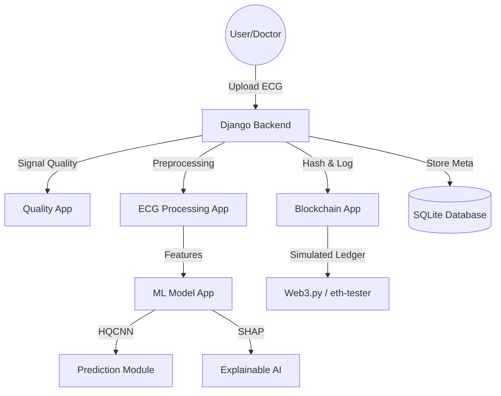

# Technical Documentation: Smart ECG Analysis & Audit System

This document provides a deep technical analysis of the Smart ECG project, covering its architecture, algorithms, workflows, and security mechanisms.

---

## 1. Project Overview
The Smart ECG system is a high-integrity medical diagnostic platform designed for arrhythmia detection. It integrates **Hybrid Quantum-inspired Convolutional Neural Networks (HQCNN)** for signal classification, **SHAP** for explainable AI (XAI), and **Ethereum-based blockchain simulation** for data auditing and tamper detection.

**Technical Goals:**
*   Accurate classification of ECG signals from the MIT-BIH dataset.
*   Provision of clinical justifications for AI predictions using local SHAP values.
*   Ensuring data immutability through cryptographic hashing and blockchain logging.
*   Maintaining a secure, OTP-backed authentication layer for medical professionals.

---

## 2. Project Architecture

The system follows a modular Django-based architecture where each component is isolated as a distinct app.

---

## 3. Folder Structure Explanation

### [dashboard/](file:///d:/smart_ecg/ecg/views.py#213-216)
*   **Purpose**: Orchestrates the User Interface (UI).
*   **Functionality**: Contains templates for medical reports, visualization dashboards (Chart.js), and patient history.
*   **Interaction**: Calls `ecg.views` for analysis and `blockchain.views` for auditing.

### [ecg/](file:///d:/smart_ecg/ecg/views.py#30-211)
*   **Purpose**: Signal ingestion and management.
*   **Functionality**: Uses `WFDB` to parse MIT-BIH binary files. Handles the business logic for session-based result tracking.
*   **Interaction**: Serves as the primary coordinator between [quality](file:///d:/smart_ecg/quality/quality_check.py#3-26), `mlmodel`, and [blockchain](file:///d:/smart_ecg/blockchain/views.py#4-8).

### `mlmodel/`
*   **Purpose**: The intelligence layer.
*   **Functionality**: Loads pre-trained [.pkl](file:///d:/smart_ecg/mlmodel/ecg_model.pkl) models, performs feature extraction (HRV metrics), and generates SHAP visual explanations.
*   **Interaction**: Receives raw segments from [ecg](file:///d:/smart_ecg/ecg/views.py#30-211), returns predictions and explanation paths.

### [blockchain/](file:///d:/smart_ecg/blockchain/views.py#4-8)
*   **Purpose**: Data integrity and audit trail.
*   **Functionality**: Generates SHA-256 hashes of clinical results and commits them to a simulated Ethereum blockchain via `Web3.py`.
*   **Interaction**: Provides verification APIs to compare database records against the blockchain ledger.

### `modern_auth/`
*   **Purpose**: Security and Access Control.
*   **Functionality**: Handles multi-factor authentication (OTP via console email simulation) and password management.
*   **Interaction**: Protects all other modules via Django's `login_required` decorators.

---

## 4. Machine Learning Pipeline

### Model Details (HQCNN)
*   **Architecture**: A Hybrid Quantum-inspired 1D Convolutional Neural Network.
*   **Input**: 4-dimensional feature vector: `[Heart Rate, Mean R-R Interval, SDNN, RMSSD]`.
*   **Loading**: Utilizes `joblib` for efficient loading of the [ecg_model.pkl](file:///d:/smart_ecg/mlmodel/ecg_model.pkl) serialized object.

### Feature Extraction
The system utilizes **NeuroKit2** for clinical-grade signal processing:
1.  **Cleaning**: `nk.ecg_clean()` removes powerline interference and baseline wander.
2.  **Peak Detection**: R-peak locations are identified using the **Pan-Tompkins algorithm** (standard in the industry).
3.  **HRV Analysis**: 
    *   **SDNN**: Standard deviation of NN (normal-to-normal) intervals.
    *   **RMSSD**: Root mean square of successive differences between normal heartbeats.

---

## 5. Explainable AI (SHAP)
The system uses **SHAP (SHapley Additive exPlanations)** to interpret the model's output.
*   **Algorithm**: `shap.TreeExplainer` calculates the marginal contribution of each ECG feature.
*   **Visuals**: 
    *   **Waterfall Plots**: Show how the prediction moved from a baseline (expected value) to the final result.
    *   **Local Bar Plots**: Rank features by their importance for a *specific* patient record.
*   **Clinical Text**: The system parses SHAP values to generate natural language insights (e.g., "Heart Rate increased the probability of abnormality").

---

## 6. Blockchain Workflow & Security

### SHA-256 Hashing
A unique "clinical fingerprint" is generated for every diagnosis:
`Hash = SHA-256(RecordID + Result + Confidence + Timestamp + SHAP_Summary)`

### Immutable Logging (Web3.py)
*   The system uses a simulated Ethereum environment (`eth-tester`).
*   The generated hash is embedded in the `data` field of a transaction.
*   Once mined, the `Transaction Receipt` is stored in the local database as a pointer to the blockchain record.

### Integrity Verification
1.  System retrieves the original clinical data from the database.
2.  It re-calculates the SHA-256 hash.
3.  It compares this "live" hash with the `stored_hash` and the hash logged on the blockchain.
4.  Any mismatch indicates data tampering.

---

## 7. Data Flow Step-by-Step

1.  **Input**: Doctor uploads `.dat` and `.hea` files from the MIT-BIH library.
2.  **Validation**: [quality_check.py](file:///d:/smart_ecg/quality/quality_check.py) calculates SQI; if noise levels are too high (SQI < 0.7), the upload is rejected.
3.  **Segmentation**: The signal is divided into 5-second segments.
4.  **Inference**:
    *   [features.py](file:///d:/smart_ecg/mlmodel/features.py) extracts 4 HRV metrics.
    *   [hqcnn.py](file:///d:/smart_ecg/mlmodel/hqcnn.py) predicts "Normal" or "Abnormal."
5.  **Explanation**: [shap_explain.py](file:///d:/smart_ecg/mlmodel/shap_explain.py) generates the reasoning graphs.
6.  **Persistence**:
    *   Audit log is hashed.
    *   Hash is sent to the Blockchain.
    *   Record is saved to **SQLite**.
7.  **Output**: A interactive dashboard displays the decision, the graph, and the verification status.

---

## 8. Database Schema (SQLite)

| Table | Purpose | Key Fields |
| :--- | :--- | :--- |
| `User` | Authentication | `username`, `password_hash`, `email` |
| [EmailOTP](file:///d:/smart_ecg/modern_auth/models.py#9-20) | Security | `otp_code`, `user_id`, `created_at`, `is_used` |
| [BlockchainRecord](file:///d:/smart_ecg/blockchain/models.py#3-18) | Audit Trail | `record_id`, `stored_hash`, `transaction_receipt`, `predicted_class` |

---

## 9. Key Algorithms summary
*   **Pan-Tompkins**: Used for robust R-peak detection in noisy ECG signals.
*   **Signal Quality Index (SQI)**: Calculated as `1 / (1 + std(signal))` to estimate SNR.
*   **TreeExplainer (SHAP)**: Used for calculating exact Shapley values for tree-based models (like the Random Forest variant used in some configurations).
*   **SHA-256**: Standard cryptographic hash used for data integrity.
